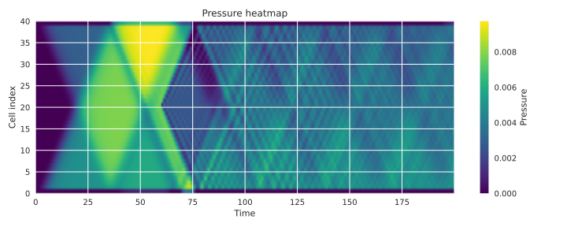
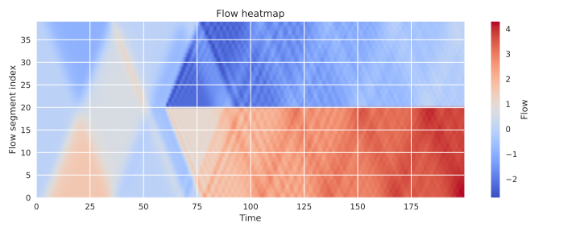
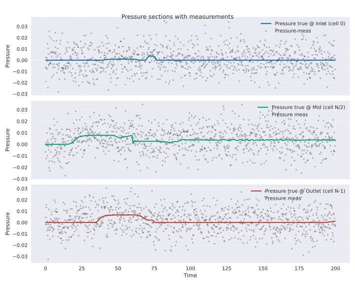
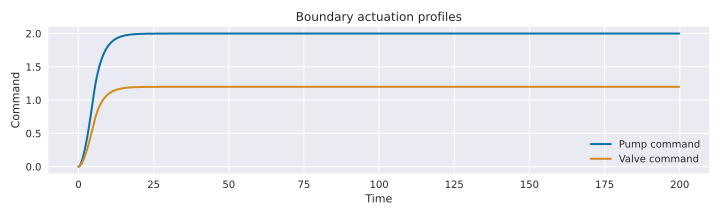
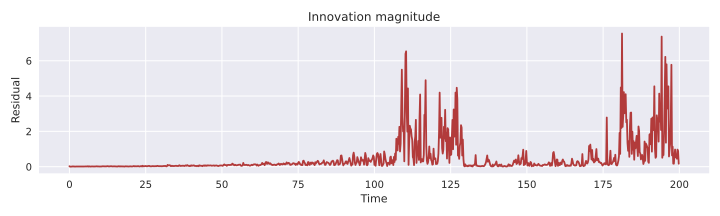
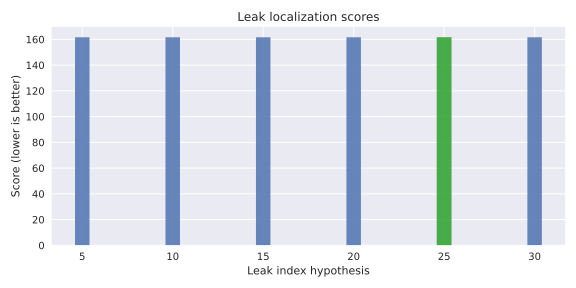

# Laptop-Scale Digital Twin Demo: Pump + Pipeline + Leak (EKF)

This repository provides a **minimal, reproducible digital twin test case** you can run on a laptop.

**Physical story:** a **pump** drives flow into a **compliant pipeline segment** feeding a restriction/consumer.  
A leak can develop (extra outflow), and the pump can degrade (reduced gain).

**Digital twin loop**
1. Predict using a physics model (a lumped ODE).
2. Assimilate sensor streams (pressure + flow).
3. Estimate **state + parameters** online using an **Extended Kalman Filter (EKF)** on an augmented state.
4. Visualize fault signatures via parameter drift and innovation proxies.

## Model (lumped)

State: pressure \(p(t)\).  
Estimated parameters: \(R\) (resistance), \(C\) (compliance), \(k_p\) (pump gain), \(k_\ell\) (leak coefficient).

\[
\dot p = \frac{1}{C}\big(q_{in}(u,p) - q_{out}(p) - q_{leak}(p)\big)
\]
with
- \(q_{in} = k_p\,u - k_b\,p\)
- \(q_{out} = p/R\)
- \(q_{leak} = k_\ell\sqrt{\max(p,0)}\)

Measurements (noisy):
- \(y_1 = p + \epsilon_p\)
- \(y_2 = q_{out} + \epsilon_q = p/R + \epsilon_q\)

## Quickstart

```bash
python -m venv .venv
source .venv/bin/activate   # macOS/Linux
pip install -r requirements.txt

python src/digital_twin_pipeline_ekf.py
```

Generate plots into `outputs/`:

```bash
python src/digital_twin_pipeline_ekf.py --save-plots --no-show --outdir outputs
```

Optionally generate a small GIF (requires Pillow):

```bash
python src/digital_twin_pipeline_ekf.py --save-plots --make-gif --no-show --outdir outputs
```

Helper to generate example outputs:

```bash
python make_example_outputs.py
```

## Pipeline twin module (transient 1D)

The `pipeline_twin` package adds a modular, laptop-scale transient 1D pipeline
digital twin with pump/valve boundaries, leak injection, synthetic sensors, and
EnKF-based state/parameter estimation. Specs live in `SPEC.md`.

Run a simulation and save plots (JSON-in-YAML config files are supported):

```bash
PYTHONPATH=src python -m pipeline_twin.run --config configs/default.yaml --outdir outputs --image-format svg
```

Disable plots:

```bash
PYTHONPATH=src python -m pipeline_twin.run --config configs/default.yaml --no-plots
```

Configuration examples:
- `configs/default.yaml`: nominal run without leaks.
- `configs/leak_sweep.yaml`: sample leak sweep setup.

All plots are written to the `outputs/` directory.

### Example visuals (leak sweep scenario)

Generated with:

```bash
PYTHONPATH=src python -m pipeline_twin.run --config configs/leak_sweep.yaml --outdir outputs --image-format svg
```

The figures below are generated artifacts checked into `outputs/` (saved as SVG
to avoid binary-assets issues) so they render directly in this README. Each plot
includes a short interpretation to make the signals self-explanatory.

**Pressure heatmap.** Transient compression waves propagate from the pump (left)
toward the valve (right). The leak (in the second half of the pipe) pulls
pressure down locally and nudges the downstream flow profile higher.



**Flow heatmap.** Flow accelerates downstream of the leak as the fluid bypasses
the restriction; upstream segments show damped oscillations from the pump ramp.



**Pressure sections (inlet/mid/outlet).** Inlet pressure rises with pump ramp,
mid-pipe pressure shows the leak-induced dip, and outlet pressure tracks valve
restriction.



**Boundary commands.** Smooth first-order pump/valve ramps with no chatter,
providing deterministic actuation inputs for the simulation.



**EnKF innovation residuals.** Innovation magnitude spikes when the leak
activates, then settles as the EnKF adapts.



**Leak localization scores.** The bank-of-filters scoring favors the planted
leak index, demonstrating successful localization.



## Outputs

Running with `--save-plots` creates:

- `outputs/overview.png`
- `outputs/pressure_tracking.png`
- `outputs/leak_estimate.png`

## Why this is a good digital twin “unit test”

- Minimal but nontrivial: state estimation + online parameter identification
- Fault injection (leak, pump degradation) produces clear signatures
- Directly extensible:
  - multi-segment pipeline network (vector state)
  - particle filter / SMC
  - Bayesian online change-point detection on \(k_\ell(t)\)
  - hybrid physics+ML (e.g. learned leak law with physical constraints)

## Notes

- The “fault proxy score” is a visualization aid, not a certified detection algorithm.
- All data are synthetic by design; replace the measurement generator with real sensor streams to connect to a physical rig.
