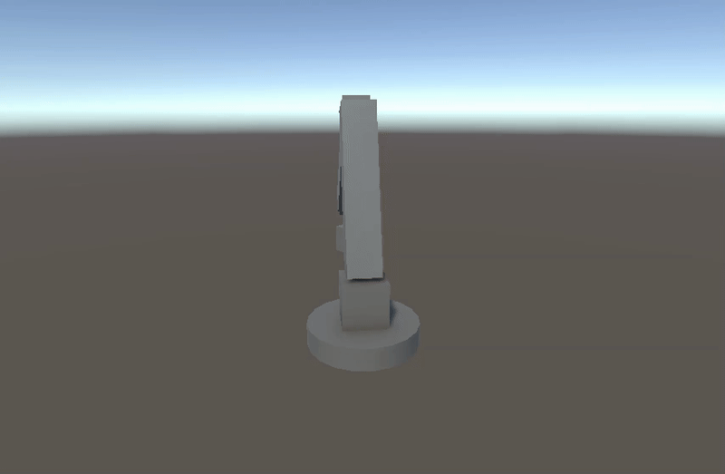
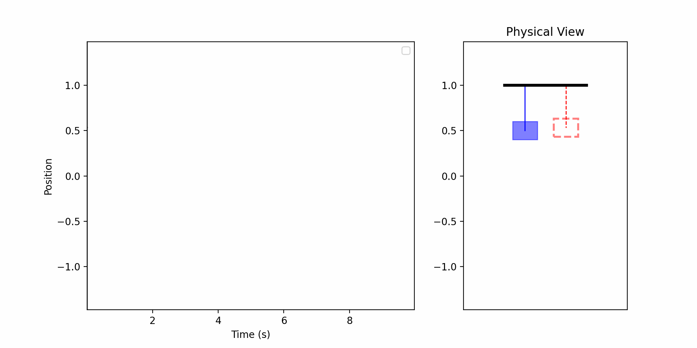
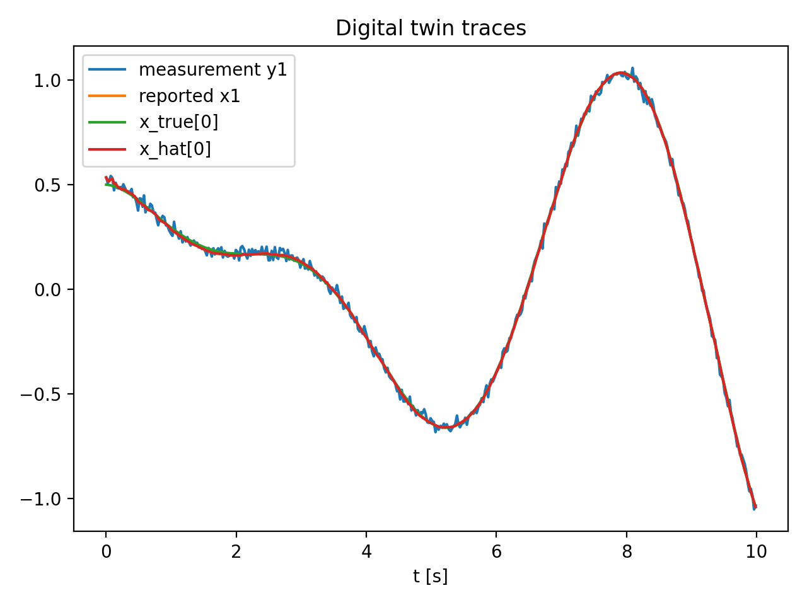
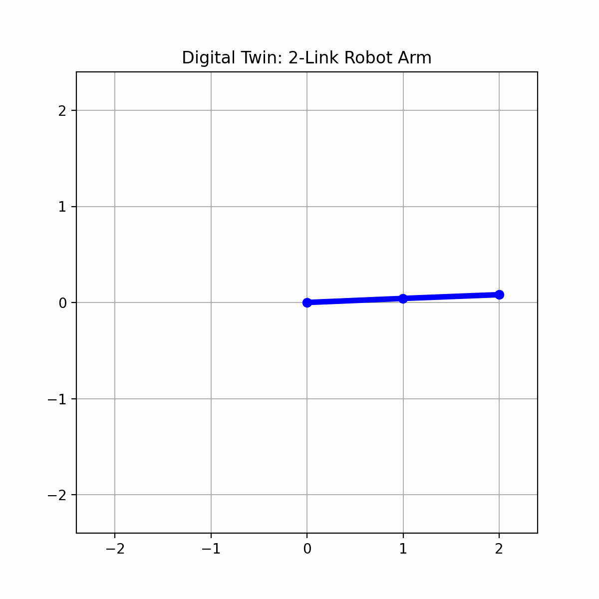

# Digital Twin Starter Kit (CPU-first, laptop friendly)

This repository is a **starter kit** for MSc Data Science projects in **Digital Twins** under realistic constraints:
- **No advanced GPU required**
- Works on a **laptop** (CPU-first)
- Supports **simulator-first** workflows and **real sensor** integration
- Designed so a coding agent (Codex / Claude) can extend it into a full MSc project repo

> A digital twin here means: a computational model that is **synchronized** to an asset (real or simulated) via data,
> performs **state estimation + parameter calibration**, and supports **prediction / what-if / decision-making**.

## What’s included

### 1) A minimal “twin telemetry spine” (Python → Unity via TCP/JSON)
- Python runs a dynamical system (example models included) and streams newline-delimited JSON over TCP.
- Unity receives the stream and updates a GameObject in real time.

Files:
- `python/twin/run_twin_stream.py`  (streams state + measurements)
- `unity/Scripts/TcpJsonTelemetryClient.cs`  (Unity receiver)

### 2) Twin models (examples)
- `python/twin/models/mass_spring_damper.py`  
- `python/twin/models/thermal_rc.py`  (room/house thermal 1R1C)
- `python/twin/models/robot_arm.py` (2-link planar arm)

### 3) Filters / state estimation
- `python/twin/filters/ekf.py`  (Extended Kalman Filter with numerical Jacobians)
- `python/twin/filters/ukf.py`  (Unscented Kalman Filter)

### 4) Evaluation hooks
- `python/eval/evaluate_log.py` computes basic RMSE and plots traces from recorded runs.
- `python/telemetry/telemetry_client_record.py` records the JSON stream into CSV/JSONL.

### 5) Tool landscape notes (Unity, Gazebo, Webots, MuJoCo, ROS 2)
- `docs/TOOLS.md` provides a practical tool matrix and recommendations.

### 6) Realistic 3D assets guide
- `docs/REALISTIC_ASSETS.md` shows how to upgrade from basic Unity primitives to professional 3D models using free assets.

---

## Quick start

### Prereqs
- Python 3.10+
- Unity (any recent LTS is fine; URP optional)
- (Optional) VS Code

### Python environment
```bash
cd python
python -m venv .venv
source .venv/bin/activate
pip install -r requirements.txt
```

### Run the twin stream (no Unity needed yet)
```bash
python -m twin.run_twin_stream --model msd --filter ekf --port 5555 --hz 50 --log out/msd_run.jsonl
```

### Unity setup (minimal)
1. Create a new Unity 3D project.
2. Copy `unity/Scripts/` into `Assets/Scripts/`.
3. Create a Cube.
4. Add the `TcpJsonTelemetryClient` component to an empty GameObject.
5. Drag the Cube into the `target` field.
6. Press Play (Unity) after starting the Python streamer.

See: `unity/README_Unity_Setup.md`

### Headless Mode (No Unity)
To run the simulation and logging without a Unity connection:
```bash
python -m twin.run_twin_stream --headless --seconds 10 --log out/run.jsonl
```

### 3D Animation (Python)
To generate a 3D animation (GIF) from a recorded log:
```bash
python -m eval.animate_msd --log out/run.jsonl --out out/animation.gif
```

---

## Robotic Arm Model (New!)
Simulate a 2-link planar robot arm.

**Run Simulation:**
```bash
python -m twin.run_twin_stream --model arm --headless --seconds 10 --log out/arm_run.jsonl
```

**Visualize (Python):**
```bash
python -m eval.animate_arm --log out/arm_run.jsonl --out out/arm_animation.gif
```

**Visualize (Unity) - Automated Setup:**
1. Open the project in Unity.
2. In the top menu, click **DigitalTwin > Setup Robot Arm Scene**.
3. Press **Play**.

**Visualize (Unity) - Manual Setup (If menu is missing):**
1. Create an empty GameObject named `RobotArm`.
2. Create an empty child named `ShoulderPivot` at `(0,0,0)`.
3. Create a Cylinder child of `ShoulderPivot`, move it to `(0,1,0)` (so it sits on top).
4. Create an empty child of `ShoulderPivot` named `ElbowPivot` at `(0,2,0)` (top of the first arm).
5. Create a Cylinder child of `ElbowPivot`, move it to `(0,1,0)`.
6. Add `RobotArmTelemetryClient.cs` to `RobotArm`.
7. Drag `ShoulderPivot` to **Joint 1** and `ElbowPivot` to **Joint 2**.

**Run Simulation (Python):**
> **Note:** Always run these commands from the `python/` directory!
```bash
cd python
python -m twin.run_twin_stream --model arm --port 5555 --hz 50
```

**Visualize (Unity):**
1. Create a Cylinder (Joint1) and a child Cylinder (Joint2).
2. Attach `RobotArmTelemetryClient.cs` to a manager object.
3. Drag the cylinders into `Joint1` and `Joint2` fields.
4. Set `Axis1` and `Axis2` to `(0, 0, 1)` (Z-axis).

### 3D Pick-and-Place Arm (New!)
A 3-DOF arm that performs a pick-and-place task using Inverse Kinematics.

**Run Simulation:**
```bash
python -m twin.run_twin_stream --model arm3d --port 5555 --hz 50
```

**Visualize (Unity):**
1. Run **DigitalTwin > Setup Robot Arm Scene**.
2. Press **Play**.
3. Run the python script above.

**Want Realistic Visuals?**
The demo uses basic Unity primitives (cylinders, cubes). To upgrade to professional-looking 3D models with realistic materials:
- **Complete Unity Beginner?** Start with **[Unity Beginner Walkthrough](docs/UNITY_BEGINNER_WALKTHROUGH.md)** - Creates a new project from scratch with realistic assets
- **Have Unity Experience?** See **[Realistic Assets Guide](docs/REALISTIC_ASSETS.md)** for asset upgrade instructions
- Use free assets from Unity Asset Store, Sketchfab, or TurboSquid
- Takes 1-2 hours for beginners, 30-60 minutes if you know Unity

---

## Core project patterns (choose one)

### Pattern A — “State-estimation twin”
- Define a dynamical model.
- Define a measurement model (noisy sensors).
- Run EKF/UKF to estimate hidden state.
- Visualize estimated state and uncertainty.

### Pattern B — “Hybrid physics + ML residual”
Model:
\[
 x_{k+1} = f(x_k, u_k; \theta) + \Delta f_\phi(x_k,u_k)
\]
- Start with a physics model.
- Learn a small residual model \(\Delta f_\phi\) on CPU (tiny MLP / ridge / kernel).
- Validate generalization and failure modes.

### Pattern C — “Calibration/identifiability twin”
- Simulate data with unknown \(\theta\).
- Fit \(\hat\theta\) by optimization (least squares, CMA-ES, Bayesian optimization).
- Quantify identifiability and confidence intervals.

### Pattern D — “Twin + decision”
- Add a controller / policy (PID, MPC-lite).
- Optimize a cost (comfort vs energy; tracking vs actuation).

---

## Recommended tool choices

### When Unity is a good choice
Use Unity when you want:
- A polished **interactive** 3D front-end / UI
- Fast iteration on scenes, user interaction, AR/VR options
- A “twin dashboard” that is more than plots

### When to prefer robotics simulators
If you want high-fidelity sensor/robot models with less custom coding, consider:
- **Gazebo Sim** (robotics, sensors, physics, plugins)
- **Webots** (beginner-friendly, full robot environment)
- **MuJoCo** (excellent contact dynamics; great for model-based control / RL baselines)

See: `docs/TOOLS.md`

---

## Repo layout

```
digital-twin-starter-kit/
  README.md
  AGENTS.md
  docs/
    TOOLS.md
    PROJECT_IDEAS.md
    TWIN_MATH.md
  python/
    requirements.txt
    telemetry/
      telemetry_server_minimal.py
      telemetry_client_record.py
    twin/
      __init__.py
      run_twin_stream.py
      models/
        mass_spring_damper.py
        thermal_rc.py
      filters/
        ekf.py
        ukf.py
      utils/
        jsonl.py
        numerics.py
    eval/
      evaluate_log.py
  unity/
    README_Unity_Setup.md
    Scripts/
      TcpJsonTelemetryClient.cs
      Telemetry.cs
```

---

## Next steps (for a student)
1. Pick a system and define:
   - state \(x\), inputs \(u\), measurements \(y\)
2. Implement \(f\) and \(h\)
3. Run EKF/UKF; record logs
4. Create evaluation plots + metrics
5. Optionally add:
   - parameter calibration
   - uncertainty quantification
   - decision/control
   - multi-sensor fusion
   - real sensor data (MQTT, serial, etc.)

---

## Example Output

### Robot Arm Digital Twin Demo (Unity + Python)

The video below demonstrates the **Digital Twin** system in action, showing a 2-link planar robot arm synchronized in real-time between Python (physics simulation + state estimation) and Unity (3D visualization).

**What you're seeing:**
- **Unity Visualization**: The 3D robot arm rendering updates in real-time based on telemetry streamed from Python
- **Physics Simulation**: Python runs a full dynamics model (mass matrix, Coriolis forces, gravity) using RK4 integration
- **State Estimation**: Extended Kalman Filter (EKF) estimates joint angles from noisy sensor measurements
- **Telemetry Pipeline**: JSON data streams over TCP at 50Hz, demonstrating the digital twin "spine"

This showcases the core digital twin workflow: a computational model (Python) synchronized to a visualization layer (Unity) via real-time data streaming, enabling state estimation, prediction, and decision-making.

**Unity Simulation (Original)**



**AI-Enhanced Version (GEN-3 Alpha Turbo)**


> **Comparison**: The top video shows the raw Unity simulation with physics-based dynamics. The bottom video was processed through **Runway's GEN-3 Alpha Turbo** (video-to-video AI model), which adds cinematic quality and realistic textures while preserving the motion dynamics.
>
> **Original high-quality videos**: [Unity (MOV)](docs/images/robot_arm_demo.mov) | [AI-Enhanced (MP4)](docs/images/RoboticHand.mp4)

---

Here is the Digital Twin in action (Headless Python Mode):

### 3D Animation (Mass-Spring-Damper)
The blue box represents the **True System** (simulating physics + unknown disturbances).
The red dashed box is the **Digital Twin** (using EKF to estimate state from noisy sensor data).



### Telemetry Traces
The plot below shows the position tracking. The Twin (red dashed) closely follows the measurements (blue line) and the underlying true state, filtering out noise.



### Robotic Arm (2-Link)
The new `arm` model simulates a 2-link planar robot performing a dance.



---

## Experimental: AI Video Enhancement

The robot arm demo was processed through **Runway's GEN-3 Alpha Turbo** (video-to-video model) to explore how generative AI interprets physics-based simulations. See the side-by-side comparison in the **Robot Arm Digital Twin Demo** section above.

**Key Observations**:
- ✨ **Visual Enhancement**: The AI model adds cinematic quality, realistic metal textures, and atmospheric lighting
- 🎯 **Physics Preservation**: Motion dynamics and temporal consistency are maintained—the Kalman filter's state estimation remains intact
- ⚠️ **Geometric Limitations**: Visual artifacts appear where geometry is ambiguous (e.g., gripper-handle interaction)
- 🔍 **Honest Assessment**: Neither the Unity original nor the AI version shows perfect handle grasping—the physics simulation tracks state correctly, but visual alignment needs refinement

**Insight**: This experiment demonstrates that **generative AI enhances aesthetics** while **physics-based models ensure trustworthy predictions**—they're complementary tools, not competing approaches. For industrial digital twins, physics accuracy is paramount; AI post-processing can make demos more visually compelling for stakeholder presentations.

---

## Notes
- This repo intentionally avoids heavy dependencies and GPUs.
- The Unity side is deliberately minimal; expand it into a dashboard (UI, plots, uncertainty bands) as needed.
